# Requirements

### Overview & Goals
Add a reporting step to the Skiko CI (attached to the existing **publish-dry-run** workflow) that measures and summarizes the size of every native artifact Skiko produces on each platform, so reviewers can spot binary-size regressions in a PR before merging.

### Scope
**In scope**
- Measure sizes of Skiko native binaries produced by the existing dry-run publications:
  - Linux: `libskiko-linux-x64.so`, `libskiko-linux-arm64.so` (and any `libEGL/libGLESv2` runtime companions).
  - Windows: `skiko-windows-x64.dll`, `skiko-windows-arm64.dll` (and ANGLE `libEGL.dll`, `libGLESv2.dll`).
  - macOS: `libskiko-macos-x64.dylib`, `libskiko-macos-arm64.dylib`.
  - Wasm/JS: `skiko.wasm`, `skiko.mjs`, `skiko-kjs.js`, `skiko-kjs-wasm.mjs` (both `es6` and `d8` variants where present).
  - Kotlin/Native: reuse the **linked `test.kexe`** binaries produced by `linkDebugTest<Target>` for `linuxX64/Arm64`, `macosX64/Arm64`, `iosX64/Arm64/SimulatorArm64` — these already exist in `tests.yml` after the corresponding test tasks run, and their size reflects link-time dead-code stripping, so it is a realistic proxy for final iOS/native app size.
  - Skottie counterpart artifacts (`skiko-skottie-*`), for completeness.
- Produce a Markdown report per job appended to `$GITHUB_STEP_SUMMARY`, and a combined table in an aggregation job's summary.
- No JSON artifact uploads exposed as workflow outputs; the tables in CI job summaries are the deliverable.
- **Optional binary upload** (default **off**): expose a boolean workflow input (`upload_binaries`, default `false`) that, when enabled, uploads the measured binaries themselves (dynamic libs, `skiko.wasm`, mjs/js exports, `test.kexe`) as workflow artifacts alongside the size tables.

**Out of scope**
- Historical tracking / baselining across commits.
- Uploading machine-readable JSON artifacts for downstream tooling — deliverable is the rendered CI table only.
- Failing the build on size thresholds.
- Detailed section-level breakdown (`bloaty` / `twiggy` / `llvm-objdump --section`).
- Publishing to external dashboards.

### User Stories
- *As a Skiko maintainer*, I want to see the size of every Skiko native binary produced by a PR right in the workflow summary, so that I can spot unexpected growth without downloading artifacts.
- *As a reviewer*, I want a single aggregated Markdown table listing all OS/arch/target binaries with their raw and compressed sizes, so I can compare against the previous build at a glance.
- *As an iOS integrator*, I want to see the size of the **linked iOS `test.kexe`** produced during tests, since it reflects post-link-time dead-code stripping and is a much better proxy for final app-size impact than the raw `.klib`.
- *As a developer investigating a regression*, I want to optionally opt-in (via a workflow input, default off) to have the measured binaries themselves uploaded as CI artifacts, so I can download and inspect the exact files that produced the reported numbers without a local build.

### Functional Requirements
- Reporting is split by data source:
  - **JVM / Wasm / JS / Android** binaries are measured in `publish-dry-run.yml` after `publishToMavenLocal`, descending into jars to report the actual payload files (`libskiko-*.so/dll/dylib`, `skiko.wasm`, `*.mjs`, `*.js`).
  - **Kotlin/Native** binaries (including iOS) are measured in `tests.yml` from the `test.kexe` files already produced by the existing test / `linkDebugTest*` steps — no rebuild.
- For each measured file the report includes: `platform`, `arch`, `artifact/kexe`, `file`, `size_bytes`, `size_human` (KiB/MiB), and `sha256` (first 12).
- The Markdown summary is grouped by platform and sorted stably by artifactId + filename so diffs stay readable across runs.
- A final aggregation step (in each workflow) renders a single combined table into `$GITHUB_STEP_SUMMARY`.
- Both reusable workflows (`publish-dry-run.yml` and `tests.yml`) expose a `workflow_call` input `upload_binaries: boolean` (default `false`). `pull-request.yml` and `post-merge.yml` pass it through with the same default; it can be flipped per-run when the workflows are triggered via `workflow_dispatch`.
- When `upload_binaries == true`, each job additionally uploads the measured binaries via `actions/upload-artifact@v4` (`if: ${{ inputs.upload_binaries }}`) using a job-scoped artifact name (e.g. `skiko-binaries-<job>`), keeping standard retention. When `false` (default), no such upload happens and CI cost stays unchanged.

### Non-Functional Requirements
- Zero added Gradle build time: reuse artifacts already produced by `publishToMavenLocal` (JVM/Wasm/JS) and by `linkDebugTest*` / test tasks already scheduled in `tests.yml` (native/iOS).
- No new external dependencies — implement measurement as Gradle tasks using the JDK standard library, with a small Python standard-library aggregator.
- Works uniformly on Linux, macOS and Windows runners without platform-specific shell utilities.

# Technical Design

### Current Implementation
- CI entry points: `.github/workflows/pull-request.yml` and `.github/workflows/post-merge.yml` call the reusable workflow `.github/workflows/publish-dry-run.yml`.
- `publish-dry-run.yml` runs six jobs that each execute `./gradlew -p skiko ... publishToMavenLocal` variants. After each job, the local Maven repo `~/.m2/repository/org/jetbrains/skiko/**` contains that platform's published artifacts.
- Where the binaries live inside those artifacts:
  - **JVM runtime jars** (`skikoJvmRuntimeJarTask` in `skiko/buildSrc/src/main/kotlin/tasks/configuration/JvmTasksConfiguration.kt`) — contain `libskiko-<os>-<arch>.<so|dll|dylib>` at the jar root; the shared-lib extension mapping is defined by `OS.dynamicLibExt` in `skiko/buildSrc/src/main/kotlin/properties.kt`.
  - **ANGLE additional runtime jars** — contain `libEGL.dll` / `libGLESv2.dll` (see `AdditionalRuntimeLibraries.kt`).
  - **Wasm jar** (`skikoWasmJar` in `WasmTasksConfiguration.kt`) — contains `skiko.wasm`, `skiko.mjs`, `skikod8.mjs`, and the `skiko-kjs*` re-export mjs.
  - **Kotlin/Native `.klib`** (`configureNativeTarget` in `NativeTasksConfiguration.kt`) — a zip containing `default/targets/<target>/native/*.bc/*.a` including the Skia static archives (`libskia.a`, `libskparagraph.a`, …) and the bridge library `libskiko-<target>.a`.
- `SkikoArtifacts` (used in `skiko/ci/build.gradle.kts`) already enumerates every artifactId Skiko publishes, so we have a canonical source of truth for what to measure.

### Key Decisions
1. **Where the logic lives.** Gradle tasks own binary discovery, archive inspection, hashing, staging, and per-job Markdown generation. A small standalone Python script only merges Markdown fragments from separate CI jobs.
2. **How the report is delivered.** Rendered Markdown table appended directly to `$GITHUB_STEP_SUMMARY`. **No JSON artifact uploads** — Markdown fragments are used for in-workflow aggregation and retained for one day as transport artifacts.
3. **Native/iOS source = linked test.kexe (not klib).** Sizes are read from `skiko/build/bin/<target>/debugTest/test.kexe` (and the `skiko-skottie` counterpart). Rationale: after link-time dead-code stripping, the kexe reflects a realistic Skia+Skiko footprint. Raw `.klib` sizes are misleading because they bundle unstripped Skia static archives.
4. **Where to measure native/iOS.** In `.github/workflows/tests.yml`, **reusing binaries already produced by existing test steps** (`iosX64TestWithMetal`, `iosSimulatorArm64Test`, `linkDebugTestLinuxArm64`, macOS test tasks). No extra `linkDebugTest*` invocations are added.
5. **Where to measure JVM/Wasm/JS/Android.** In `.github/workflows/publish-dry-run.yml`, using `~/.m2/repository/org/jetbrains/skiko/**` after `publishToMavenLocal`. Descend into jars to report inner payload sizes (`*.so`/`*.dll`/`*.dylib`/`*.wasm`/`*.mjs`/`*.js`).
6. **Aggregation.** Each of the two workflows has its own final summary step that concatenates all per-job Markdown fragments (via `actions/download-artifact` used only for in-workflow transport — not published as a user-facing artifact) and appends a single grouped table to that workflow's `SizeReport` job summary.
7. **Opt-in binary upload.** A `workflow_call` boolean input `upload_binaries` (default `false`) is added to both `publish-dry-run.yml` and `tests.yml`. It is guarded on the extra upload steps via `if: ${{ inputs.upload_binaries }}`. Rationale: keeps default CI runs cheap and artifact-clean, while giving a one-click way (in `workflow_dispatch`) to get the real binaries for offline inspection. The tables in the summary remain the primary deliverable regardless.

### Proposed Changes
1. **New Gradle reporting tasks and aggregation script**:
   - A Maven-local reporting task walks `~/.m2/repository/org/jetbrains/skiko`, descends into jars/AARs, and emits a Markdown fragment.
   - A linked-native reporting task scans `skiko/build/bin` and `skiko-skottie/build/bin` for `*.kexe` and emits a Markdown fragment.
   - `skiko/tools/ci/aggregate_binary_size_reports.py <inputs-dir> <out-md>` only concatenates and stably re-groups per-job Markdown fragments.
   - JDK and Python standard libraries only.
2. **Workflow edits in `.github/workflows/publish-dry-run.yml`** (JVM/Wasm/JS/Android):
   - After each `publishToMavenLocal` step in `Android`, `Web`, `Linux`, `LinuxArm`, `macOS`, `Windows`, invoke the Maven-local Gradle reporting task and append its output to `$GITHUB_STEP_SUMMARY`.
   - Add a `SizeReport` job (`needs: [Android, Web, Linux, LinuxArm, macOS, Windows]`, `if: always()`) that collects per-job Markdown fragments (transported via `actions/upload-artifact`/`download-artifact` internally; not surfaced as a user-facing artifact) and appends one grouped table to its own `$GITHUB_STEP_SUMMARY`.
3. **Workflow edits in `.github/workflows/tests.yml`** (native/iOS):
   - After the existing iOS and native test steps, invoke the linked-native Gradle reporting task and append its output to `$GITHUB_STEP_SUMMARY`.
   - Add a small aggregation step at the end of `tests.yml`'s macOS/native path that appends one combined table for all measured `test.kexe` files.
4. **Opt-in binary upload wiring** (both workflows):
   - Add `on.workflow_call.inputs.upload_binaries` (`type: boolean`, `default: false`, `required: false`) to `publish-dry-run.yml` and `tests.yml`.
   - Update the callers (`pull-request.yml`, `post-merge.yml`) to pass the default-false `workflow_dispatch` input to both reusable workflows.
   - In `publish-dry-run.yml` jobs, add a conditional step `Upload measured binaries` (`if: ${{ inputs.upload_binaries }}`) that uploads a curated file list (the inner `*.so/*.dll/*.dylib/*.wasm/*.mjs/*.js` extracted from the maven-local jars into a staging dir by the reporting script) as `skiko-binaries-<job>`.
   - In `tests.yml`, add a matching conditional step that uploads the discovered `test.kexe` files (and Skottie counterparts) as `skiko-native-binaries-<label>`.
   - Both Gradle reporting tasks accept an optional staging directory: when provided, they copy each measured payload file into `<dir>/<platform>/<arch>/<file>` so the upload step has a single directory to upload.
5. **No added Gradle build work.** Reporting tasks only inspect already-produced outputs and do not depend on compilation or linking tasks.

### Data Models / Contracts
Rendered Markdown table (columns): `Platform | Arch | Source | File | Size | SHA256`.

Example rows:

 Platform | Arch  | Source                          | File                              | Size      | SHA256 |
----------|-------|---------------------------------|-----------------------------------|-----------|--------|
 macOS    | arm64 | skiko-jvm-runtime-macos-arm64   | libskiko-macos-arm64.dylib        | 11.0 MiB  | ab12ef… |
 iOS      | arm64 | skiko debugTest kexe            | test.kexe                         | 27.4 MiB  | 90cd11… |
 Wasm     | wasm  | skiko-wasm                      | skiko.wasm                        | 6.2 MiB   | 5b7a03… |

No JSON deliverable is published from the workflow — per-job Markdown fragments are the transport format between the platform jobs and the aggregation step.

### File Structure
```
.github/workflows/publish-dry-run.yml            (modified — JVM/Wasm/JS/Android size steps + SizeReport job)
.github/workflows/tests.yml                      (modified — native/iOS kexe size steps + aggregation)
skiko/ci/build.gradle.kts                         (modified — reporting tasks)
skiko/tools/ci/aggregate_binary_size_reports.py   (new — concatenate Markdown fragments)
skiko/tools/ci/README.md                         (new — usage + iOS kexe caveat)
```

### Architecture Diagram

```mermaid
graph TD
    subgraph publish-dry-run.yml
      A1[publishToMavenLocal] --> A2[~/.m2/repository/org/jetbrains/skiko/**]
      A2 --> A3[Gradle Maven size task]
      A3 --> A4[Per-job Markdown table -> GITHUB_STEP_SUMMARY]
      A3 --> A5[Markdown fragment for aggregation]
      A5 --> A6[SizeReport job aggregate]
      A6 --> A7[Combined table in SizeReport summary]
    end
    subgraph tests.yml
      B1[Existing iOS/native test tasks] --> B2[skiko/build/bin/**/debugTest/test.kexe]
      B2 --> B3[Gradle kexe size task]
      B3 --> B4[Per-job Markdown table -> GITHUB_STEP_SUMMARY]
      B3 --> B5[Markdown fragment for aggregation]
      B5 --> B6[Native SizeReport aggregate]
      B6 --> B7[Combined table in summary]
    end
```


### Risks
- **Gradle configuration overhead.** Reporting requires a lightweight Gradle invocation after existing build commands; tasks have no build dependencies and only inspect files already present.
- **iOS kexe is still an approximation.** A test kexe is not exactly the same as a real app kexe (test framework/assertions add code, no bitcode/App Store shrinking). Documented in `tools/ci/README.md`, but it is a far better proxy than `.klib`.
- **Coupling to `tests.yml`.** If the iOS/native test tasks are skipped (e.g. platform gate), the corresponding size row will be absent. The aggregate table tolerates missing fragments and renders the available rows.
- **Version noise in filenames.** Snapshot version suffix is stripped in the Markdown `File` column for readable diffs across runs.
- **Artifact storage cost when `upload_binaries` is enabled.** Uploading `.dylib`/`.so`/`.dll`/`.wasm`/`test.kexe` adds significant artifact storage; mitigated by keeping the input **off by default**, restricting it to `workflow_dispatch`, and using standard artifact retention rather than extending it.

# Delivery Steps

### ✓ Step 1: Add Gradle size reporting tasks and aggregation script
Reusable Gradle tasks render Markdown fragments for maven-local artifacts and linked `test.kexe` binaries; a small Python script aggregates fragments across jobs.

- Add Gradle tasks that report Maven-local archive payloads and linked `*.kexe` files, with platform, architecture, source, bytes/human size, and SHA-256 columns.
- Add `skiko/tools/ci/aggregate_binary_size_reports.py` that reads a directory of Markdown fragments and emits one grouped table (grouped by platform, sorted by artifact/source + filename).
- Add `skiko/tools/ci/README.md` documenting inputs, outputs, the iOS `test.kexe` caveat (test framework overhead, no App Store shrinking), and how to run locally.
- Portability: use only JDK standard-library APIs for ZIP reading, file sizes, SHA-256, copying, and sorting; Python standard library for aggregation.
- Verify locally against a populated `~/.m2` and existing `skiko/build/bin` outputs without rebuilding them.

### ✓ Step 2: Wire size reporting into `publish-dry-run.yml` (JVM / Wasm / JS / Android)
Each publish-dry-run job appends a per-job binary-size table to its own CI job summary; a final `SizeReport` job renders the combined table.

- Edit `.github/workflows/publish-dry-run.yml`:
  - After the final `publishToMavenLocal` step of `Android`, `Web`, `Linux`, `LinuxArm`, `macOS`, `Windows`, invoke the Maven-local reporting task and append its Markdown output to `$GITHUB_STEP_SUMMARY`.
  - For the `Linux` job which publishes twice (x64 host + native cross), run the report only once after both publish steps complete.
  - Save the same Markdown fragment to `sizes-<job>.md` and upload it via `actions/upload-artifact@v4` as a hidden transport artifact (retention 1 day) — not a user deliverable.
- Add a `SizeReport` job (`needs: [Android, Web, Linux, LinuxArm, macOS, Windows]`, `if: always()`, `runs-on: ubuntu-24.04`) that:
  - Uses `actions/download-artifact@v4` with `pattern: sizes-*` to fetch all fragments.
  - Runs the Python aggregation script to produce a single grouped Markdown table.
  - Appends the table to `$GITHUB_STEP_SUMMARY` — no artifact upload.

### ✓ Step 3: Wire native/iOS size reporting into `tests.yml` (reuse existing test.kexe)
The iOS and native test jobs already build `test.kexe` binaries; we measure them without any extra Gradle work.

- Edit `.github/workflows/tests.yml`:
  - After `iosX64TestWithMetal`, `iosSimulatorArm64Test`, `linkDebugTestLinuxArm64`, and the macOS native test steps, invoke the linked-native reporting task and append Markdown to `$GITHUB_STEP_SUMMARY`.
  - Include `skiko/skiko-skottie/build/bin` in the same scan for the Skottie counterparts.
  - Save the same fragment to `sizes-native-<label>.md` and upload as a hidden transport artifact.
- Add a native `SizeReport` job that downloads all `sizes-native-*` fragments and appends a single combined table to `$GITHUB_STEP_SUMMARY` via `aggregate_binary_size_reports.py`.
- Manually trigger both workflows on a branch to confirm the tables render correctly and no `test.kexe` is missing.

### ✓ Step 4: Add opt-in `upload_binaries` workflow input (default off)
Both reusable workflows expose a boolean `upload_binaries` input; when enabled, each job additionally uploads its measured binaries as artifacts. Default keeps behavior unchanged.

- Support an optional Gradle staging-directory property on both reporting tasks: when set, the task copies each measured payload file (extracted inner jar entries; `test.kexe` files) into `<dir>/<platform>/<arch>/<file>` while producing the Markdown fragment. No behavior change when the property is absent.
- Edit `.github/workflows/publish-dry-run.yml`:
  - Add `on.workflow_call.inputs.upload_binaries` (`type: boolean`, `default: false`, `required: false`).
  - In each publish job, pass `-PbinarySizeStageDir="$RUNNER_TEMP/skiko-binaries"` to the reporting task.
  - Add a conditional `Upload measured binaries` step guarded by `if: ${{ inputs.upload_binaries }}` that uses `actions/upload-artifact@v4` with `name: skiko-binaries-<job>` and `path: ${{ runner.temp }}/skiko-binaries`.
- Edit `.github/workflows/tests.yml`:
  - Add the same `upload_binaries` `workflow_call` input.
  - Wire the kexe reporting task with `-PbinarySizeStageDir` and add a matching conditional `Upload native binaries` step producing `skiko-native-binaries-<label>` artifacts.
- Edit `.github/workflows/pull-request.yml` and `.github/workflows/post-merge.yml`:
  - Pass the default-false dispatch input to both reusable workflow invocations.
  - Add `on.workflow_dispatch.inputs.upload_binaries` (`type: boolean`, `default: false`) so maintainers can toggle it when manually re-running.
- Verify by running the workflows twice on a branch: once with `upload_binaries=false` (no artifacts uploaded, summary unchanged) and once with `upload_binaries=true` (per-job binary artifacts appear and their contents match the sizes in the summary).

### ✓ Step 5: Decouple GitHub reporting from the TeamCity CI project
The binary-size feature is GitHub Actions-specific, so its Gradle task registrations must not modify the TeamCity-oriented `skiko/ci` build.

- Restore `skiko/ci/build.gradle.kts` to its pre-feature state.
- Register the existing `BinarySizeReportTask` tasks in the main `skiko/build.gradle.kts` build.
- Update GitHub Actions to invoke the root reporting tasks.
- Run focused Gradle tests and workflow syntax validation.

### ✓ Step 6: Use existing Gradle artifact and target models
Replace scanner-style platform inference with typed Gradle inputs sourced from configured publications and Kotlin/Native targets.

- Remove the `binarySizePlatform` workflow property and filename-based architecture inference.
- Configure Maven archive inputs from canonical `SkikoArtifacts` platform/architecture metadata.
- Configure linked test executable inputs from Kotlin/Native target outputs and metadata without adding link dependencies.
- Keep reporting tasks limited to validation, hashing, optional staging, and Markdown rendering.
- Run focused Gradle tests, workflow syntax validation, and diff checks.

### ✓ Step 7: Move binary-size reporting to a dedicated manual workflow
Build and measure direct Gradle outputs in an isolated, manually triggered workflow instead of coupling size reporting to publication or test execution.

- Add `.github/workflows/binary-sizes.yml` with explicit platform jobs and a default-off `upload_binaries` dispatch input.
- Build JVM, Android, and Web payloads directly without `publishToMavenLocal`; link native `debugTest` executables without running tests.
- Render per-job Markdown summaries, transport one-day fragments, and aggregate available reports in a final `if: always()` job.
- Remove binary-size inputs, steps, transport jobs, and caller wiring from `publish-dry-run.yml`, `tests.yml`, `pull-request.yml`, and `post-merge.yml`.
- Update Gradle task inputs, tests, and documentation for direct task outputs, then run focused tests, workflow syntax validation, and diff checks.

### ✓ Step 8: Produce module-local binary-size reports
Move report task registration into reusable `buildSrc` configuration so each Skiko module owns its report and staging outputs.

- Register archive and linked-executable report tasks per module through `SkikoProjectContext`.
- Default reports and staged binaries to each module's own `build` directory, avoiding cross-module input and output collisions.
- Replace root report tasks with lightweight lifecycle tasks and update the manual workflow to aggregate module-local fragments and uploads.
- Update focused tests and documentation, then run Gradle tests, workflow syntax validation, and diff checks.

### ✓ Step 9: Invoke module report tasks directly
Remove redundant root lifecycle tasks and invoke each module-local report task directly from the manual workflow.

- Delete the root `reportAllArchiveBinarySizes` and `reportAllKexeBinarySizes` task registrations.
- Update the workflow and documentation to call the core and Skottie report tasks directly.
- Run focused Gradle checks, workflow syntax validation, and diff checks.